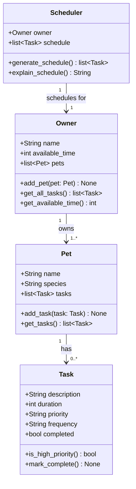

# PawPal+ Project Reflection

## 1. System Design

**a. Initial design**

- Briefly describe your initial UML design.
The initial UML design should let the user enter information about them and their pet, then add tasks with durations and priorities, and finally generate a daily schedule based on that information, which also should be able to explain the reasoning behind the schedule.

- What classes did you include, and what responsibilities did you assign to each?
The main classes I can think of are: 'Owner', 'Pet', 'Tasks', 'Scheduler'. The attributes of 'Owner' might include name,available time, pets, and tasks; the methods could include adding pets and tasks, and retrieving available time. For 'Pet', attributes could include 'name', and 'species'. For 'Task', attributes could include 'description', 'duration', and 'priority', and the methods could include checking if it's high priority. For 'Scheduler', it should have as attributes 'owner' and 'tasks'; it should include a method to generate a schedule based on the tasks and time constraints of the owner, and a method to explain the reasoning behind the schedule.

**b. Design changes**

- Did your design change during implementation?
Yes, the design did change during implementation.

- If yes, describe at least one change and why you made it.
I asked Copilot if it noticed any missing relationships or potential logic bottenecks, and told me four issues it noticed. The first one is that Scheduler should derive its task list from owner. tasks rather than maintaining a separate one. The second one is that Task is not linked to Pet, which means the scheduler can't reason about which pet a task belong to, so an attribute is needed. The third one is that right now priority is a string, so any string is valid, so I need to flag invalid values as an error. The fourth one is that is not clear what the method get_available_time() returns, so I need to clarify that it returns the time avaiable by the owner minus the tasks durations. The fifth one is that the method generate_schedule() returned a list but it wasn't saving it anywhere, and lastely, the method explain_schedule() needs to describe that schedule but it has no way to access it.
---

## 2. Scheduling Logic and Tradeoffs

**a. Constraints and priorities**

- What constraints does your scheduler consider (for example: time, priority, preferences)?
- How did you decide which constraints mattered most?

**b. Tradeoffs**

- Describe one tradeoff your scheduler makes.
- Why is that tradeoff reasonable for this scenario?

---

## 3. AI Collaboration

**a. How you used AI**

- How did you use AI tools during this project (for example: design brainstorming, debugging, refactoring)?
- What kinds of prompts or questions were most helpful?

**b. Judgment and verification**

- Describe one moment where you did not accept an AI suggestion as-is.
- How did you evaluate or verify what the AI suggested?

---

## 4. Testing and Verification

**a. What you tested**

- What behaviors did you test?
- Why were these tests important?

**b. Confidence**

- How confident are you that your scheduler works correctly?
- What edge cases would you test next if you had more time?

---

## 5. Reflection

**a. What went well**

- What part of this project are you most satisfied with?

**b. What you would improve**

- If you had another iteration, what would you improve or redesign?

**c. Key takeaway**

- What is one important thing you learned about designing systems or working with AI on this project?
