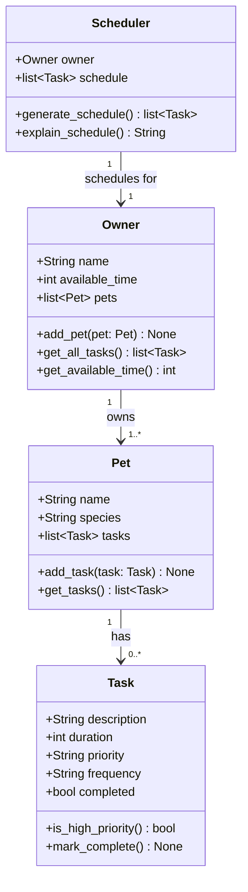

# PawPal+ Project Reflection

## 1. System Design

**a. Initial design**

- Briefly describe your initial UML design.
The initial UML design should let the user enter information about them and their pet, then add tasks with durations and priorities, and finally generate a daily schedule based on that information, which also should be able to explain the reasoning behind the schedule.

- What classes did you include, and what responsibilities did you assign to each?
The main classes I can think of are: 'Owner', 'Pet', 'Tasks', 'Scheduler'. The attributes of 'Owner' might include name,available time, pets, and tasks; the methods could include adding pets and tasks, and retrieving available time. For 'Pet', attributes could include 'name', and 'species'. For 'Task', attributes could include 'description', 'duration', and 'priority', and the methods could include checking if it's high priority. For 'Scheduler', it should have as attributes 'owner' and 'tasks'; it should include a method to generate a schedule based on the tasks and time constraints of the owner, and a method to explain the reasoning behind the schedule.

**b. Design changes**

- Did your design change during implementation?
Yes, the design did change during implementation.

- If yes, describe at least one change and why you made it.
I asked Copilot if it noticed any missing relationships or potential logic bottenecks, and told me four issues it noticed. The first one is that Scheduler should derive its task list from owner. tasks rather than maintaining a separate one. The second one is that Task is not linked to Pet, which means the scheduler can't reason about which pet a task belong to, so an attribute is needed. The third one is that right now priority is a string, so any string is valid, so I need to flag invalid values as an error. The fourth one is that is not clear what the method get_available_time() returns, so I need to clarify that it returns the time avaiable by the owner minus the tasks durations. The fifth one is that the method generate_schedule() returned a list but it wasn't saving it anywhere, and lastly, the method explain_schedule() needs to describe that schedule but it has no way to access it.
---

## 2. Scheduling Logic and Tradeoffs

**a. Constraints and priorities**

- What constraints does your scheduler consider (for example: time, priority, preferences)?
The scheduler considers two main constraints: the owner's available time for the day (in minutes) and the priority level of each task (high, medium, or low). It also checks for time conflicts.

- How did you decide which constraints mattered most?
I prioritized high-priority tasks like feeding or walking your pets. Available time came second since it's a real limit (you can't fit 4 hours of work into 2 hours). Conflict detection was added mainly as a warning to alert the user, not as a hard rule, since sometimes tasks can overlap in practice.

**b. Tradeoffs**

- Describe one tradeoff your scheduler makes.
The scheduler picks tasks in priority order and skips any task that doesn't fit the remaining time, without going back to try smaller tasks that might still fit.

- Why is that tradeoff reasonable for this scenario?
I tradeoff I am doing is that rather than storing priority as a number (like 1, 2, 3), the system stores it as a word ("high", "medium", "low"). This is a tradeoff because it makes the system more user-friendly and easier to understand, but it also means that the system needs to validate the input to ensure that only valid priority levels are accepted, which adds some complexity to the implementation.

---

## 3. AI Collaboration

**a. How you used AI**

- How did you use AI tools during this project (for example: design brainstorming, debugging, refactoring)?
I did the UML design and AI helped me discovered some issues with it. I also used AI to help me write thec code needed for the system skeleton, and to help me write the tests.

- What kinds of prompts or questions were most helpful?
I think the most helpful prompts were those that asked for feedback on my design, and those that asked for suggestions on how to implement certain methods or features.

**b. Judgment and verification**

- Describe one moment where you did not accept an AI suggestion as-is.

When I asked AI about optimizing my code it suggested a way to optimize the code that I thought was too complex for me to understand, so I preferred to keep it more simple.

- How did you evaluate or verify what the AI suggested?

I evaluated the AI suggestion by considering how the system is supposed to work.
---

## 4. Testing and Verification

**a. What you tested**

- What behaviors did you test?

I tested things like marking a task as complete, adding a task to a pet, sorting tasks by time, checking that a daily task creates a new one for the next day, and making sure the conflict detection catches two tasks at the same time.

- Why were these tests important?

Because those are the main things the app is supposed to do. If marking a task complete or detecting a conflict didn't work, the whole schedule would be unreliable.

**b. Confidence**

- How confident are you that your scheduler works correctly?

I am confident for the tests that AI helped me write because they all passed.

- What edge cases would you test next if you had more time?

What happens if the owner has zero available time, What if two pets have tasks at the exact same time, and what if you try to filter by a pet name that doesn't exist.

---

## 5. Reflection

**a. What went well**

- What part of this project are you most satisfied with?

I'm most happy with how smooth the owner and pet information is collected and also how easy it is to add tasks.

**b. What you would improve**

- If you had another iteration, what would you improve or redesign?

The UI, I would like to make it more visually appealing, also adding an option to add the pet's picture, and maybe adding some more features like a calendar view of the schedule. Also I am missing a button to mark a task as complete in the UI.

**c. Key takeaway**

- What is one important thing you learned about designing systems or working with AI on this project?

I liked using AI to create a classes skeleton and asking it for help with the UML design, I liked that it gave me feedback that improved the logic of it.